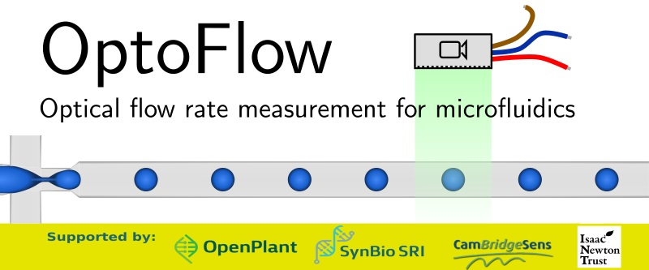

OptoFlow: Optical flow rate measurement for microfluidics
=========================

We aim to develop a sensor system for measuring the flow rate and characterising the water-in-oil droplets generated in a microfluidics system.  The measurements would be displayed on an LCD screen, transmitted via serial interface to a PC or other system or fed into our existing open source flow control system.  This measurement would allow for highly repeatable microfluidics experiments, since we are looking directly at the final droplets instead of upstream variables such as pressure that, even if constant, could produce different droplets or flow rates across experiments or even within one experiment.  We will use an optical mouse sensor for measuring droplet motion and further process the image on the attached Arduino to produce the final measurements.  The components are low cost and easy to assemble and program.  Optionally and additionally, we could use a high resolution open source 3D printed microscope to produce more accurate measurements for characterisation and comparison.

# Team
## "Tobey" Tobias Wenzel
 
Department of Physics & Department of Chemical Engineering and Biotechnology, University of Cambridge
Is an experienced open source hardware developer and documenter. He contributes expertise to the team in quantitative biology with microorganisms, optical imaging (incl. the open flexure microscope), 3d-printing, and micro-fabrication techniques.

## Christie Nel
 
Scaturio Ltd
Will provide embedded systems- and software engineering experience and design and program the sensor system and software algorithms.  Has experience with microfluidic flow systems.

## Tanya Hutter
 
Department of Chemistry, University of Cambridge
Tanya has experience in developing chemical sensors, optical sensing technologies and microfluific devices. She will help with system design, assembly, results analysis and technical summary report writing.

## Monica Saavedra
Base4 Innovation
Monica has experience in microfluidics, especially producing water droplets in oil.

## Steven Burgess
 
eLife Sciences
Has experience working on a project that used microdroplets and has an awareness of the user requirements. Member of biomakespace. Will be involved in the testing phase of the project to feed back into the design and help with dissemination of results via social media.  Experience with openscope.

# Project information 

## Hardware
In order to make the OptoFlow project open source, we will be fully documenting the project on [DocuBricks](https://docubricks.com/) with links to ordered parts and a reference to the open source software, which will be hosted on Github.  We will also aim to submit an article to the [Journal of Open Hardware](http://journalofopenhardware.org/).

## The problem
When producing microfluidic water droplets in oil for running biological experiments, it is important to be able to reproduce experimental parameters well.  Water and oil flow rates determine the quality and size of the water droplets and thus the amount of biological matter encapsulated in each droplet, the rate at which they move through the system, the effectiveness of sorting- and any other microfluidic mechanisms present.  Measuring the flow rates of the water and oil is difficult and often omitted in favour of setting pressures and hoping to get roughly the same flow rates and droplet size and separation.  This is not always the case, given the variance between microfluidic chips, tubing, connectors and environmental factors such as temperature, which affects viscosity and overall chip resistivity.  By looking directly at the droplets produced by the microfluidics chip and feeding the measurements into a flow control system, we will have the best low-cost control over droplet generation and thus experiment repeatability.

## The biological system
The sensor could be used for any experiment that produces water droplets in oil, e.g. for high-throughput cellular or cell-free droplet experimentation, but we will not necessarily need to include any biological systems in the design of this sensor.

## The design goals for the hardware
To interface an optical mouse sensor such as ADNS-3080, for which Arduino code is already available, with an Arduino that will process the sensor data and produce droplet characterization in the form of flow rate and droplet and oil volume, which can either be displayed on an LCD screen, fed back into the flow control system or transmitted over a serial interface to a PC or other system.  These components are very inexpensive.  We need to develop a way to physically attach the sensor to a microfluidics system and possibly adjust/calibrate.  Finally, the necessary documentation needs to be completed.  Optional: We will initially use breadboard, but can also design a PCB if time allows.  Depending on our success at this point, we could further use an existing open source 3D printed microscope attached to a Raspberry Pi or PC to produce higher precision measurements.

## How we plan to implement the project
We still start off by choosing and acquiring an optical mouse sensor and associated optics, as well as an Arduino, breadboard and components required as per datasheet.  We will then produce the Arduino software drivers to interface with the sensor, read the sensor data, perform basic processing and transmit the final measurements to a PC terminal via serial interface.  We will then attach the optical sensor and optics to the outlet tubing of our existing microfluidics flow system and droplet generator and develop software algorithms to extract the necessary measurements from the optical data.  The LCD screen can then be attached, interfaced and display software written.  Finally, we can round off the ongoing documentation and look at the optional goals listed above.

## Proposed outcomes and benefits
We will produce a microfluidic droplet flow measurement system that can be interfaced via serial or LCD or could feed directly into our existing open source flow system.  Open source design, code and documentation will be included.  Benefits include low cost components, but accurate flow rate measurements and control for highly repeatable microfluidics experiments.
